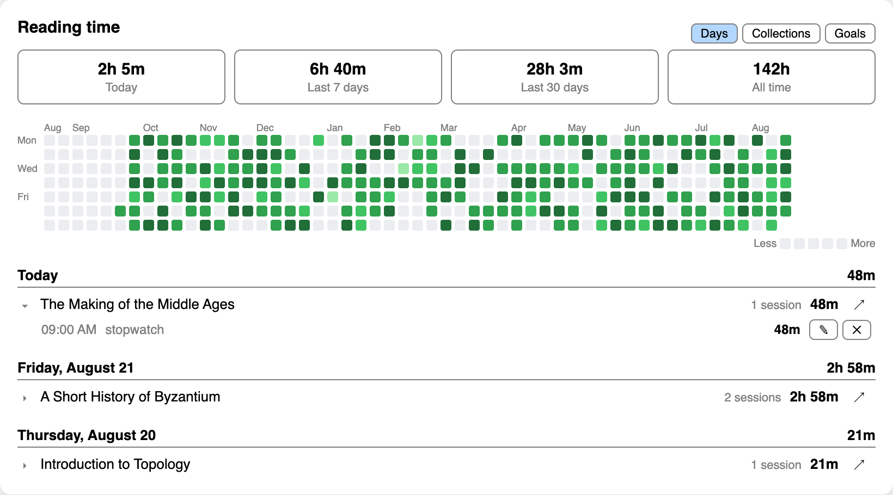
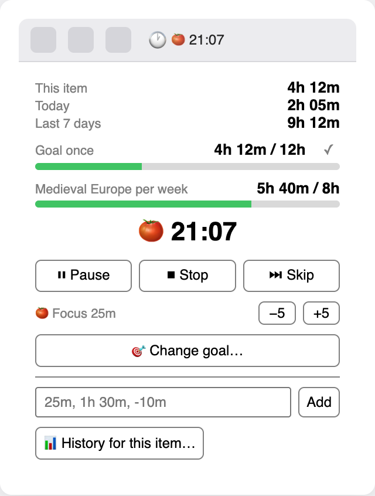
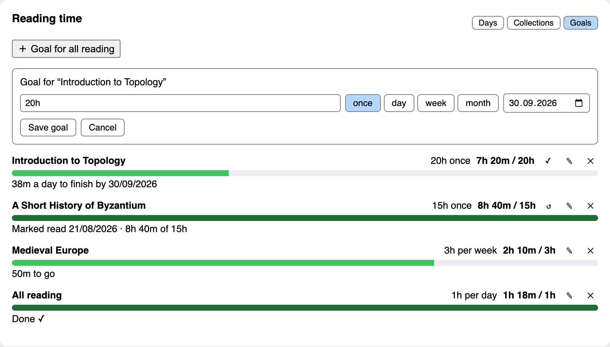
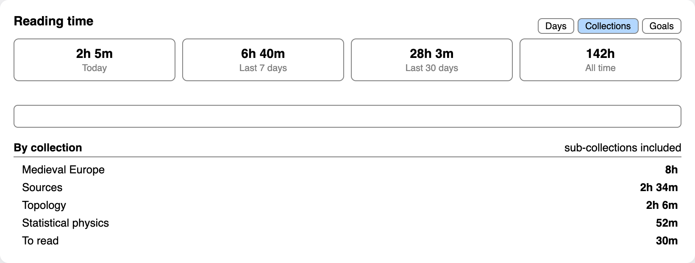

# Reading Time (Zotero plugin)

Built for **Zotero 10**. It uses plugin APIs that arrived across the 7.x line —
reader toolbar events, custom item-tree columns, item-pane info rows, and the
menu API — and is only tested against 10.



Adds a 🕐 button to the reader toolbar — and to a note opened in its own tab or
window, since writing about a book is time spent on it. Click it for a small
popup with three ways to log time on the item you're reading:

- **⏱ Stopwatch** — counts up until you pause or stop.
- **🍅 Pomodoro** — clicking it doesn't start anything: the length appears with
  `−5` / `+5` to adjust (5–120 min) and a **▶ Start** button. Then focus / 5 min
  break, with a chime and a notification at each switch; breaks don't count
  toward reading time. The length can still be adjusted mid-run, and is
  remembered in `extensions.zotero.readingTime.focusMin`.
- **Manual entry** — type `25`, `1h 30m`, `45s`, or `-10` to subtract.
- **✓ Mark as read** — tags the item in Zotero and nothing else: no goal, no
  session, no bookkeeping. Click it again to take the tag off. It uses the same
  tag as goals do, asking for one the first time.
- **A note** — one line about what you read, belonging to the session being
  timed. Stopping saves it and empties the field, so what's on screen is always
  the note for what's running now. Notes sit on their sessions line in the history window, where any of them can still be written or changed later.

A session under a minute isn't saved: a file opened by mistake is not reading,
and keeping those turns the history into noise. One you wrote a note against is
kept however short it was.

Time on an attachment or a note lands on its parent item, so a book's total is
the reading and the note-taking together. A note in the item pane or the
reader's sidebar gets no button — there the reader's own timer is already
counting onto the same item.

Leave the tab you're reading on and the clock follows you: a small box in the
bottom right, wherever you go in Zotero — the library, another book, a note. It
appears on its own and needs no menu item; a running timer is otherwise
invisible the moment you look away. The title on it is the way back — click it
to jump to that tab, or to the item in the library if nothing is open on it any
more. **▴** unfolds the whole popup (stats, Pause/Stop, goals, manual entry),
**▾** folds it back, **✕** hides it until the next session starts. The one place
it stays out of is the tab of the very thing being timed, which has the clock in
its own toolbar already.

While a timer runs the live time sits inside the clock button, so you can close
the popup and keep reading. The popup also shows **This item / Today / Last 7
days**, and the item's total appears as a **Reading time** row in the item pane
(editable — an edit is logged as a manual adjustment).

In the library view, right-click the column headers and tick **Reading time** to
show the per-item total as a sortable column. It sorts by real duration, not by
the text, and it refreshes when a timer stops — not every second, since that
would rebuild the tree.

## History

**Tools → Reading Time History…** (or the 📊 button in the reader popup) opens a
window with:

- totals for today / 7 days / 30 days / all time, and the streak you're on
  (`🔥 12-day streak · longest 31`) while one is alive — yesterday still counts,
  so it doesn't break every morning before you sit down;
- a GitHub-style heatmap of the last 53 weeks — hover a square for that day's
  time, click one to jump to that day below;
- every day you read, newest first, with each item's time and session count.
  Click a line to unfold that day's individual sessions — each one can be
  re-timed (✎, enter a new duration; 0 deletes it) or deleted (✕), and each
  carries a note — click under a session to write what you read. Use ↗ to
  select the item in the library.

For one item only, use **↗ right-click an item → Reading Time History…** in the
library, or the 📊 button in the reader popup. Right-clicking a **collection**
does the same for everything in it, sub-collections included. Everything — totals, heatmap,
day list — narrows to it; "← All items" goes back.

The **Collections** tab is a view of its own: every collection you've read in,
biggest first, with a fuzzy filter — `mdv` finds *Medieval Europe*. Time in a
sub-collection counts towards its parents, and an item in two collections counts
in both, so those totals can add up to more than the time you actually spent.
Click one to narrow the window to it and drop back to the day view.

Collection membership is asked of Zotero when you open the window, never stored:
collections change, sessions don't.

## Goals

The **Goals** tab adds them: **＋ Book** and **＋ Collection** search your whole
library, filtered as you type, and **＋ All reading** covers everything.
You can also set one on the book in front of you from the reader popup — **🎯
Set a goal…**, or by clicking an existing goal's bar — or right-click any book
or collection in the library → **Set reading goal…**.

Goals are filed by what they're about — **All reading** first, then **Books**
and **Collections** — with **Finished** last: a one-off goal leaves the pile once it's
marked read or the time is in. Recurring goals never do, since they start again. A goal is a target plus a period:

- `20h` **once** (the default), optionally by a date — the window then shows the pace
  you'd need (`38m a day to finish by 30 Sep`);
- `3h` **per week**, or per day, or per month — progress resets each period.

Finished the book faster than you planned? **✓** marks a one-off goal read —
it counts as done however much time it actually took, and the goal keeps the
real figure (`Marked read 21/08 · 8h 40m of 15h`) rather than pretending you
spent the hours. **↺** reopens it. Recurring goals have no ✓: a weekly target
starts again on Monday, so there is nothing to finish early.

Marking a book read with **✓** can tag it in Zotero. The first time you do it,
you're asked what the tag should be — `read` is offered, and leaving it empty
means no tagging, which is then remembered. The Goals tab says what it does — *Marking read adds
the tag "read"* — off to the right; click that to change it. Marking a goal read also stops whatever is being timed toward it — the last seconds land first. Only your click tags anything: a goal
that reaches its target on its own is never tagged, and **↺** takes the tag off
again.

A goal's title is a link: it selects that book or collection in the library.
There is only ever one *all reading* goal — a second would be a competing
answer to the same question, so setting one replaces it.

Collection goals count sub-collections, and an item counts towards both its own
goal and any collection goal covering it. `All reading` goals cover the whole
library. Whatever you're reading shows its two most relevant goals as bars in
the reader popup, and a goal announces itself the moment it's met — once per
period, not once per session.

Goals live in a `goals` table beside the sessions, keyed by item/collection key
rather than a numeric id, so they survive anything that renumbers rows. The
target of a deleted item or collection is shown as *(deleted)* rather than being
cleaned up behind your back.

## What it looks like

A clock button in the reader toolbar, showing the live time, with everything
else a click away — totals for the item, goal progress, the timer controls, and
manual entry:



Goals, with the pace needed to hit a deadline:



Where the time went, by collection, with a fuzzy filter:



## Storage

Everything lands in **`time-tracker.sqlite`**, the plugin's own database next to
`zotero.sqlite` in your Zotero data directory. One append-only row per session:

```sql
CREATE TABLE sessions (
    id        TEXT PRIMARY KEY,
    libraryID INTEGER NOT NULL,
    itemKey   TEXT NOT NULL,
    title     TEXT,                -- as of when the session ran; the history
                                   -- window shows the item's current name and
                                   -- falls back to this once it is deleted
    mode      TEXT NOT NULL,       -- stopwatch | pomodoro | manual
    started   INTEGER NOT NULL,    -- unix ms
    seconds   INTEGER NOT NULL     -- countable time; manual rows may be negative
);
```

Nothing is written to the item itself, so nothing another plugin (or you) can
clobber by editing **Extra**. The trade-off: reading time doesn't sync with the
library — copy the file if you want it on another machine.

The whole table is mirrored in memory at startup, so every total in the UI is a
synchronous scan. Query it yourself for anything the popup doesn't show:

```sql
-- minutes per day, last 30 days
SELECT date(started / 1000, 'unixepoch', 'localtime') AS day,
       SUM(seconds) / 60 AS minutes
FROM sessions GROUP BY day ORDER BY day DESC LIMIT 30;

-- most-read items
SELECT title, SUM(seconds) / 60 AS minutes
FROM sessions GROUP BY libraryID, itemKey ORDER BY minutes DESC LIMIT 20;
```

Every connection the plugin opens is tracked from the moment it exists and
closed on any failure. That is not tidiness: Gecko will not finish shutting down
until every SQLite connection is closed, so one leaked connection hangs Zotero's
quit, and a Zotero that gets killed instead of quitting can lose add-on state —
which shows up as the plugin uninstalling itself.

The plugin opens it by absolute path, which tells Zotero it's an "external"
database: no WAL, no idle backups, and no integrity-check dialog at startup —
a time log should never be able to interrupt Zotero. Back it up yourself if you
care about it. Zotero holds the file open while it runs, so read it with
`sqlite3 -readonly`, or close Zotero first.

## For other plugins

While it runs, the plugin publishes one function on `Zotero`:

```js
Zotero.ReadingTime.addFeedSession(seconds, started, note)   // apiVersion 1
```

It banks time *someone else* measured — a whole sitting in one go — against a
stand-in target rather than any item, and shows up in the history as a single
**Feed reading** row. Sittings under a minute are dropped, exactly as a timer's
are; the return value says whether it was kept. The optional `note` is a line
about the sitting, landing in the same field a timer's note does.

Check for it at the moment you call it, never at startup:

```js
const rt = Zotero.ReadingTime;
if (rt && rt.apiVersion === 1) rt.addFeedSession(900, Date.now() - 900e3, "arXiv math.PR");
```

Plugins load in any order, and the object is withdrawn again on shutdown — a
reference kept from earlier can be a function whose scope has since been
deleted, which hangs whoever calls it. [Feed
Riffle](https://github.com/ievlevpn/zotero-feed-riffle) uses this to log a
riffling session; nothing else is expected to.

## Compatibility

`manifest.json` declares `strict_min_version: "9.999"` rather than `"10.0"`.
Zotero's own pre-releases version themselves as `10.0-beta.N`, and Mozilla's
comparator sorts a pre-release suffix *below* the plain number — so a minimum of
`"10.0"` would lock the plugin out of every Zotero 10 beta. The `.999` idiom is
the same one Zotero's own plugin templates used for the 7.0 betas.

`strict_max_version` is `"10.*"`, so the plugin will need a look before it runs
on Zotero 11.

## Install (dev)

```sh
# Build the installable .xpi (just a zip of these files):
cd zotero-time-tracking
zip -r reading-time.xpi manifest.json bootstrap.js locale icons
```

Then in Zotero: **Tools → Plugins → gear icon → Install Plugin From File…**
and pick `reading-time.xpi`. Open any PDF and look for 🕐 in the reader toolbar.

For live development, point Zotero at the folder instead of zipping: create a
file named `reading-time@local` (the id from `manifest.json`) inside your Zotero
profile's `extensions/` directory whose contents are the absolute path to this
folder, then restart Zotero.

## Tweak it

- The pomodoro focus length lives in the popup (`−5` / `+5`); `BREAK_MIN` at the
  top of `bootstrap.js` sets the break.
- `node test.js` runs the self-checks: duration parsing/formatting, the
  session-log sums, the heatmap grid, and a smoke test that drives a whole
  session (start → tick → pause → book closed) against a stubbed Zotero.

## Guardrails

- **Closing the book stops the timer.** A timer whose item has no reader open
  anywhere is counting time nobody is spending, and with its toolbar gone there
  is nothing on screen to notice it by. It stops, keeps what it counted, and
  says so. Only on certainty: an open tab whose item Zotero hasn't loaded reads
  as "don't know", never as closed, so switching tabs can't stop your timer.
- **One timer at a time.** Two running at once would double-count the same
  stretch of time, so starting one on another item asks before taking over —
  it never switches silently.
- **Hourly check-in.** Forgetting to stop the timer is the normal failure, so
  every hour it pauses itself and asks how much of that hour was actually
  reading, pre-filled with the elapsed time. Confirm it, type a smaller value
  (`20m`), enter `0` to throw the session away, or cancel to stop the timer and
  keep what's counted. Answering costs no time, since it pauses first. Change
  `CHECK_IN` in `bootstrap.js` to adjust.

## Caveats

- The button puts itself back. Zotero hands `renderToolbar` to every plugin
  from one unguarded loop and the reader wipes the container on each render,
  so a peer plugin that throws first takes our button down with it. A 1 Hz
  check restores it, and open readers are claimed on startup so upgrading the
  plugin doesn't leave already-open tabs without it.

- **No idle detection.** The stopwatch keeps counting if you walk away — pause
  it, or use the pomodoro. Machine sleep isn't counted (gaps over 5 s are
  ignored).
- A session that runs past midnight is cut at the boundary into one row per
  day, so neither day borrows the other's time. Sessions logged before 0.37.0
  are cut on first startup, worked out from when each began and how long it
  ran — a row that was paused across midnight may divide in the wrong place,
  since the log never recorded where the pause fell. Manual entries are left
  whole: their timestamp is when you typed them, not when you read.
- The DB is written every 60 s and on every pause/stop/phase change, so a crash
  costs at most a minute.
- Versions before 0.2.0 stored the total in the item's **Extra** field. Those
  `Reading time: …` lines are ignored now and can be deleted by hand.
